# Diagrama Entidad-Relación Completo

Este diagrama muestra todas las tablas del sistema FitoxPress y sus relaciones.

---

## Vista General por Esquemas


---

## Diagrama ER Detallado

```mermaid
erDiagram
    %% ==========================================
    %% ESQUEMA REF - Referencia
    %% ==========================================
    
    ref_city ||--o{ ref_zone : "contiene"
    ref_city ||--o{ ref_city_rate : "tiene tarifas"
    ref_city ||--o{ ref_city_alias : "tiene alias"
    ref_zone ||--o{ ref_zone_rate : "tiene tarifas"

    ref_city {
        serial id PK
        text name
        text department
    }

    ref_zone {
        bigserial id PK
        bigint city_id FK
        text name
        geometry polygon
        boolean is_active
    }

    ref_city_rate {
        bigserial id PK
        bigint city_id FK
        integer amount_gs
        date effective_from
        date effective_to
    }

    ref_zone_rate {
        bigserial id PK
        bigint zone_id FK
        integer amount_gs
        date effective_from
        date effective_to
    }

    ref_city_alias {
        bigserial id PK
        bigint city_id FK
        text alias
    }

    %% ==========================================
    %% ESQUEMA CORE - Principal
    %% ==========================================

    core_user_profile ||--o| core_merchant : "puede ser dueño"
    core_merchant ||--o{ core_merchant_address : "tiene"
    core_merchant ||--o{ core_product : "vende"
    core_merchant ||--o{ core_order : "genera"
    
    core_address ||--o{ core_merchant_address : "asignada"
    core_contact ||--|| core_recipient : "es"
    core_recipient ||--o{ core_order : "recibe"
    
    core_order ||--o{ core_order_item : "contiene"
    core_order ||--o{ core_order_event : "historial"
    core_order ||--o| core_order_pod : "tiene POD"
    core_order }o--|| core_address : "pickup"
    core_order }o--|| core_address : "dropoff"
    
    core_product ||--o{ core_order_item : "en"
    core_address }o--o| ref_city : "en ciudad"
    core_address }o--o| ref_zone : "en zona"

    core_user_profile {
        uuid auth_user_id PK
        app_role role
        text full_name
        text phone
        timestamptz created_at
        boolean is_active
        boolean password_change_required
    }

    core_merchant {
        uuid id PK
        text name
        text ruc
        merchant_tariff_mode tariff_mode
        boolean allow_tariff_fallback
        boolean is_active
    }

    core_address {
        uuid id PK
        text label
        text street
        bigint city_id FK
        bigint zone_id FK
        geometry location
    }

    core_contact {
        uuid id PK
        text full_name
        text phone
    }

    core_merchant_address {
        uuid merchant_id PK_FK
        uuid address_id PK_FK
        boolean is_default
    }

    core_recipient {
        uuid id PK
        uuid contact_id FK
        uuid default_address FK
    }

    core_product {
        uuid id PK
        uuid merchant_id FK
        text name
        text sku
        integer unit_price_gs
    }

    core_order {
        uuid id PK
        uuid merchant_id FK
        uuid recipient_id FK
        uuid pickup_address_id FK
        uuid dropoff_address_id FK
        integer cash_to_collect_gs
        delivery_status delivery_status
        cash_status cash_status
        boolean settled_with_merchant
        boolean settled_with_rider
        timestamptz requested_at
    }

    core_order_item {
        bigserial id PK
        uuid order_id FK
        uuid product_id FK
        text description
        integer qty
    }

    core_order_event {
        bigserial id PK
        uuid order_id FK
        order_status from_status
        order_status to_status
        timestamptz at
    }

    core_order_pod {
        uuid order_id PK_FK
        timestamptz delivered_at
        text receiver_name
        text photo_url
    }

    %% ==========================================
    %% ESQUEMA OPS - Operaciones
    %% ==========================================

    ops_courier ||--o{ ops_assignment : "tiene"
    ops_courier ||--o{ ops_courier_location : "reporta"
    ops_courier ||--o{ ops_courier_city : "habilitado"
    ops_courier ||--o{ ops_courier_zone : "habilitado"
    ops_courier ||--o{ ops_rider_payout : "recibe"
    
    ops_assignment }o--|| core_order : "de"
    ops_rider_payout ||--o{ ops_rider_payout_item : "contiene"
    ops_rider_payout_item }o--|| ops_assignment : "por"
    
    ops_courier_city }o--|| ref_city : "ciudad"
    ops_courier_zone }o--|| ref_zone : "zona"

    ops_courier {
        uuid id PK
        uuid auth_user_id FK
        text full_name
        text phone
        vehicle_type vehicle_type
        boolean is_active
    }

    ops_assignment {
        uuid id PK
        uuid order_id FK
        uuid courier_id FK
        assignment_status status
        timestamptz assigned_at
        timestamptz delivered_at
    }

    ops_courier_location {
        bigserial id PK
        uuid courier_id FK
        timestamptz at
        geometry location
    }

    ops_courier_city {
        uuid courier_id PK_FK
        bigint city_id PK_FK
    }

    ops_courier_zone {
        uuid courier_id PK_FK
        bigint zone_id PK_FK
    }

    ops_rider_payout {
        uuid id PK
        uuid courier_id FK
        date period_start
        date period_end
        bigint total_gs
        boolean is_paid
    }

    ops_rider_payout_item {
        bigserial id PK
        uuid payout_id FK
        uuid assignment_id FK
        integer amount_gs
    }

    %% ==========================================
    %% ESQUEMA BILLING - Facturación
    %% ==========================================

    core_order ||--|| billing_order_pricing : "tiene precio"
    core_order ||--o{ billing_collection : "tiene cobros"
    
    core_merchant ||--o{ billing_settlement : "liquidaciones"
    core_merchant ||--o{ billing_merchant_city_rate : "tarifas"
    core_merchant ||--o{ billing_merchant_zone_rate : "tarifas"
    
    billing_settlement ||--o{ billing_settlement_item : "contiene"
    billing_settlement_item }o--|| core_order : "de"
    
    billing_order_pricing }o--o| ref_city : "ciudad"
    billing_order_pricing }o--o| ref_zone : "zona"
    billing_merchant_city_rate }o--|| ref_city : "para"
    billing_merchant_zone_rate }o--|| ref_zone : "para"

    billing_order_pricing {
        uuid order_id PK_FK
        bigint city_id FK
        bigint zone_id FK
        integer base_amount_gs
        integer extras_gs
        integer total_amount_gs
    }

    billing_collection {
        uuid id PK
        uuid order_id FK
        payment_method method
        payment_status status
        integer amount_gs
    }

    billing_settlement {
        uuid id PK
        uuid merchant_id FK
        date period_start
        date period_end
        settlement_status status
        bigint total_gs
    }

    billing_settlement_item {
        bigserial id PK
        uuid settlement_id FK
        uuid order_id FK
        integer amount_gs
    }

    billing_merchant_city_rate {
        bigserial id PK
        uuid merchant_id FK
        bigint city_id FK
        integer amount_gs
        date effective_from
    }

    billing_merchant_zone_rate {
        bigserial id PK
        uuid merchant_id FK
        bigint zone_id FK
        integer amount_gs
        date effective_from
    }

    %% ==========================================
    %% ESQUEMA INGEST - WhatsApp
    %% ==========================================

    ingest_channel ||--o{ ingest_channel_merchant : "conectado"
    ingest_channel ||--o{ ingest_message : "recibe"
    ingest_channel_merchant }o--|| core_merchant : "comercio"
    
    ingest_message ||--o{ ingest_message_location : "ubicaciones"
    ingest_message ||--o{ ingest_order_intent : "genera"
    
    ingest_order_intent }o--o| ref_city : "ciudad"
    ingest_order_intent ||--o| ingest_intent_order_link : "convertido"
    ingest_intent_order_link }o--|| core_order : "pedido"

    ingest_channel {
        uuid id PK
        text provider
        text phone_number
        boolean is_active
    }

    ingest_channel_merchant {
        uuid channel_id PK_FK
        uuid merchant_id PK_FK
        boolean is_default
    }

    ingest_message {
        uuid id PK
        uuid channel_id FK
        text wa_message_id
        text from_phone
        text raw_text
        media_type media_type
        timestamptz sent_at
    }

    ingest_message_location {
        bigserial id PK
        uuid message_id FK
        float lat
        float lon
    }

    ingest_order_intent {
        uuid id PK
        uuid message_id FK
        parse_status status
        numeric confidence
        text recipient_name
        text address_text
        bigint city_id FK
        integer amount_gs
    }

    ingest_intent_order_link {
        uuid order_intent_id PK_FK
        uuid order_id FK
        timestamptz linked_at
    }

    %% ==========================================
    %% ESQUEMA AUDIT - Auditoría
    %% ==========================================

    audit_event {
        bigserial id PK
        timestamptz at
        uuid actor_auth
        text entity
        uuid entity_id
        text action
        jsonb details
    }
```

---

## Flujos de Datos

### Flujo de Pedido

```mermaid
flowchart LR
    subgraph ENTRADA
        WA[📱 WhatsApp]
    end

    subgraph INGESTA
        MSG[message]
        LOC[message_location]
        INT[order_intent]
    end

    subgraph CORE
        ORD[order]
        RCP[recipient]
        ADR[address]
    end

    subgraph OPS
        ASG[assignment]
        COU[courier]
    end

    subgraph BILLING
        PRC[order_pricing]
        COL[collection]
        STL[settlement]
    end

    WA --> MSG
    MSG --> LOC
    MSG --> INT
    INT --> |parsed| ORD
    ORD --> RCP
    ORD --> ADR
    ORD --> PRC
    ORD --> ASG
    ASG --> COU
    ORD --> COL
    COL --> |cobrado| STL
```



### Flujo de Liquidación


---

## Relaciones Clave

| Desde | Hacia | Tipo | Descripción |
|-------|-------|------|-------------|
| `order` | `merchant` | N:1 | Cada pedido pertenece a un comercio |
| `order` | `recipient` | N:1 | Cada pedido tiene un destinatario |
| `order` | `address` (pickup) | N:1 | Dirección de recogida |
| `order` | `address` (dropoff) | N:1 | Dirección de entrega |
| `order` | `order_pricing` | 1:1 | Pricing calculado del pedido |
| `order` | `assignment` | 1:N | Puede tener múltiples asignaciones |
| `order` | `collection` | 1:N | Puede tener múltiples cobros |
| `assignment` | `courier` | N:1 | Cada asignación es de un rider |
| `settlement` | `merchant` | N:1 | Liquidaciones por comercio |
| `settlement_item` | `order` | N:1 | Cada ítem referencia un pedido |
| `message` | `order_intent` | 1:N | Un mensaje puede generar varios intents |
| `order_intent` | `order` | 1:1 | Un intent crea un pedido |
| `courier` | `courier_city` | 1:N | Ciudades habilitadas |
| `courier` | `courier_zone` | 1:N | Zonas habilitadas |

---

## Navegación

- [Volver al README](../README.md)
- [Esquema ref](../schemas/ref.md)
- [Esquema core](../schemas/core.md)
- [Esquema ops](../schemas/ops.md)
- [Esquema billing](../schemas/billing.md)
- [Esquema ingest](../schemas/ingest.md)
- [Esquema audit](../schemas/audit.md)

