# Módulo de Pedidos - Panel Administrativo

> Documentación técnica para el desarrollo del módulo de gestión de pedidos en el panel de administración FitoXpress.

---

## Índice

1. [Visión General](#visión-general)
2. [Modelo de Datos](#modelo-de-datos)
3. [Flujo de Creación de Pedido](#flujo-de-creación-de-pedido)
4. [Estados y Transiciones](#estados-y-transiciones)
5. [Queries de Referencia](#queries-de-referencia)
6. [Pantallas Sugeridas](#pantallas-sugeridas)
7. [Validaciones de Negocio](#validaciones-de-negocio)

---

## Visión General

El módulo de pedidos es el núcleo del sistema FitoXpress. Un pedido representa una entrega de productos desde un comercio (merchant) hacia un destinatario (recipient), realizada por un repartidor (courier/rider).

### Entidades Principales

```
┌─────────────┐     ┌─────────────┐     ┌─────────────┐
│  Merchant   │────▶│    Order    │◀────│  Recipient  │
│  (Comercio) │     │  (Pedido)   │     │(Destinatario│
└─────────────┘     └──────┬──────┘     └─────────────┘
                          │
         ┌────────────────┼────────────────┐
         ▼                ▼                ▼
┌─────────────┐    ┌─────────────┐   ┌─────────────┐
│ Order Item  │    │  Assignment │   │Order Pricing│
│ (Productos) │    │ (Asignación)│   │  (Tarifa)   │
└─────────────┘    └──────┬──────┘   └─────────────┘
                          │
                          ▼
                   ┌─────────────┐
                   │   Courier   │
                   │   (Rider)   │
                   └─────────────┘
```

---

## Modelo de Datos

### Tablas Involucradas

| Schema | Tabla | Descripción |
|--------|-------|-------------|
| `core` | `order` | Pedido principal |
| `core` | `order_item` | Productos del pedido |
| `core` | `recipient` | Destinatario |
| `core` | `contact` | Datos de contacto |
| `core` | `address` | Direcciones |
| `core` | `merchant` | Comercio origen |
| `billing` | `order_pricing` | Tarifa de delivery |
| `ops` | `assignment` | Asignación a rider |
| `ops` | `courier` | Datos del rider |
| `ref` | `city` | Ciudades |

### Estructura de `core.order`

```sql
CREATE TABLE core.order (
  id                    uuid PRIMARY KEY DEFAULT gen_random_uuid(),
  merchant_id           uuid NOT NULL REFERENCES core.merchant(id),
  external_ref          text,                    -- Referencia externa opcional
  recipient_id          uuid REFERENCES core.recipient(id),
  pickup_address_id     uuid REFERENCES core.address(id),  -- Dirección de recogida
  dropoff_address_id    uuid REFERENCES core.address(id),  -- Dirección de entrega
  declared_value_gs     integer,                 -- Valor declarado
  cash_to_collect_gs    integer,                 -- Monto a cobrar al cliente
  notes                 text,                    -- Notas adicionales
  status                order_status,            -- Estado general (deprecated)
  delivery_status       delivery_status NOT NULL DEFAULT 'recepcionado',
  cash_status           cash_status NOT NULL DEFAULT 'sin_cobro',
  settled_with_merchant boolean NOT NULL DEFAULT false,
  settled_with_rider    boolean NOT NULL DEFAULT false,
  delivery_window_start timestamptz,             -- Ventana de entrega inicio
  delivery_window_end   timestamptz,             -- Ventana de entrega fin
  scheduled_date        date,                    -- Fecha programada (reagendados)
  reschedule_count      integer NOT NULL DEFAULT 0,  -- Contador de reagendamientos
  requested_at          timestamptz NOT NULL DEFAULT now(),
  due_by                timestamptz,
  created_by_auth       uuid,
  updated_at            timestamptz NOT NULL DEFAULT now()
);
```

### Estructura de `core.order_item`

```sql
CREATE TABLE core.order_item (
  id            bigserial PRIMARY KEY,
  order_id      uuid NOT NULL REFERENCES core.order(id) ON DELETE CASCADE,
  product_id    uuid REFERENCES core.product(id),  -- Opcional, producto del catálogo
  description   text NOT NULL,                     -- Descripción del producto
  qty           integer NOT NULL DEFAULT 1,
  unit_price_gs integer                            -- Precio unitario
);
```

### Estructura de `core.recipient`

```sql
CREATE TABLE core.recipient (
  id              uuid PRIMARY KEY DEFAULT gen_random_uuid(),
  contact_id      uuid NOT NULL REFERENCES core.contact(id),
  default_address uuid REFERENCES core.address(id)
);
```

### Estructura de `core.contact`

```sql
CREATE TABLE core.contact (
  id        uuid PRIMARY KEY DEFAULT gen_random_uuid(),
  full_name text NOT NULL,
  phone     text
);
```

### Estructura de `core.address`

```sql
CREATE TABLE core.address (
  id       uuid PRIMARY KEY DEFAULT gen_random_uuid(),
  label    text,                -- Etiqueta (ej: "Casa", "Oficina")
  street   text,                -- Calle/Dirección
  city_id  bigint REFERENCES ref.city(id),
  zone_id  bigint REFERENCES ref.zone(id),
  location geometry(Point, 4326)  -- Coordenadas GPS
);
```

### Estructura de `billing.order_pricing`

```sql
CREATE TABLE billing.order_pricing (
  order_id        uuid PRIMARY KEY REFERENCES core.order(id),
  city_id         bigint REFERENCES ref.city(id),
  zone_id         bigint REFERENCES ref.zone(id),
  base_amount_gs  integer,          -- Tarifa base de delivery
  extras_gs       integer DEFAULT 0, -- Extras
  total_amount_gs integer GENERATED ALWAYS AS (COALESCE(base_amount_gs,0) + extras_gs) STORED
);
```

### Estructura de `ops.assignment`

```sql
CREATE TABLE ops.assignment (
  id           uuid PRIMARY KEY DEFAULT gen_random_uuid(),
  order_id     uuid NOT NULL REFERENCES core.order(id),
  courier_id   uuid NOT NULL REFERENCES ops.courier(id),
  status       ops.assignment_status NOT NULL DEFAULT 'pending',
  assigned_at  timestamptz NOT NULL DEFAULT now(),
  accepted_at  timestamptz,
  picked_up_at timestamptz,
  delivered_at timestamptz,
  failed_reason text
);
```

---

## Flujo de Creación de Pedido

### Paso a Paso (Orden de Inserción)

Para crear un pedido completo, se deben insertar registros en el siguiente orden:

```
1. core.contact      → Datos del destinatario (nombre, teléfono)
         ↓
2. core.address      → Dirección de entrega (dropoff)
         ↓
3. core.recipient    → Vincula contact + address
         ↓
4. core.order        → Pedido principal
         ↓
5. core.order_item   → Productos del pedido
         ↓
6. billing.order_pricing → Tarifa de delivery
         ↓
7. ops.assignment    → Asignación al rider (opcional)
```

### Diagrama de Dependencias

```mermaid
flowchart TD
    subgraph "Paso 1: Destinatario"
        C[core.contact]
        A[core.address]
    end
    
    subgraph "Paso 2: Vincular"
        R[core.recipient]
    end
    
    subgraph "Paso 3: Pedido"
        O[core.order]
    end
    
    subgraph "Paso 4: Detalles"
        OI[core.order_item]
        OP[billing.order_pricing]
    end
    
    subgraph "Paso 5: Asignación"
        AS[ops.assignment]
    end
    
    C --> R
    A --> R
    R --> O
    O --> OI
    O --> OP
    O --> AS
```



### Ejemplo SQL de Creación Completa

```sql
-- PASO 1: Crear contacto del destinatario
INSERT INTO core.contact (full_name, phone)
VALUES ('Juan Pérez', '0981234567')
RETURNING id AS contact_id;
-- Resultado: contact_id = 'abc123...'

-- PASO 2: Crear dirección de entrega
INSERT INTO core.address (label, street, city_id)
VALUES ('Casa', 'Av. España 1234', 7)  -- 7 = Asunción
RETURNING id AS address_id;
-- Resultado: address_id = 'def456...'

-- PASO 3: Crear recipient (vincula contact + address)
INSERT INTO core.recipient (contact_id, default_address)
VALUES ('abc123...', 'def456...')
RETURNING id AS recipient_id;
-- Resultado: recipient_id = 'ghi789...'

-- PASO 4: Crear el pedido
INSERT INTO core.order (
  merchant_id,
  recipient_id,
  pickup_address_id,      -- Dirección del comercio
  dropoff_address_id,     -- Dirección de entrega
  cash_to_collect_gs,
  delivery_status,
  cash_status
)
VALUES (
  'merchant-uuid...',     -- ID del comercio
  'ghi789...',            -- recipient_id del paso 3
  'pickup-address...',    -- Dirección del merchant
  'def456...',            -- address_id del paso 2
  175000,                 -- Monto a cobrar
  'recepcionado',
  'sin_cobro'
)
RETURNING id AS order_id;
-- Resultado: order_id = 'jkl012...'

-- PASO 5: Crear items del pedido
INSERT INTO core.order_item (order_id, description, qty, unit_price_gs)
VALUES ('jkl012...', 'Producto XYZ', 1, 175000);

-- PASO 6: Crear pricing (tarifa de delivery)
INSERT INTO billing.order_pricing (order_id, city_id, base_amount_gs)
VALUES ('jkl012...', 7, 25000);  -- 7 = Asunción, 25000 Gs

-- PASO 7 (Opcional): Asignar a un rider
INSERT INTO ops.assignment (order_id, courier_id, status)
VALUES ('jkl012...', 'courier-uuid...', 'pending');
```

---

## Estados y Transiciones

### Enum `delivery_status`

| Estado | Descripción | Siguiente Estado Posible |
|--------|-------------|--------------------------|
| `recepcionado` | Pedido recibido, sin asignar | `en_transito`, `reagendado` |
| `en_transito` | Rider en camino | `entregado`, `rechazado_puerta`, `reagendado` |
| `entregado` | Entrega exitosa | (final) |
| `rechazado_puerta` | Cliente rechazó en destino | (final) |
| `reagendado` | Programado para otra fecha | `en_transito` |
| `cancelado` | Pedido cancelado | (final) |
| `devuelto` | Devuelto al comercio | (final) |

### Enum `cash_status`

| Estado | Descripción |
|--------|-------------|
| `sin_cobro` | No hay cobro pendiente o no aplica |
| `pendiente` | Cobro pendiente (rider debe cobrar) |
| `cobrado` | Dinero cobrado al cliente |
| `rendido` | Dinero entregado al comercio |

### Enum `assignment_status`

| Estado | Descripción |
|--------|-------------|
| `pending` | Asignación pendiente de aceptar |
| `accepted` | Rider aceptó la asignación |
| `picked_up` | Rider recogió el paquete |
| `delivered` | Entrega completada |
| `failed` | Entrega fallida |

### Diagrama de Estados

```mermaid
stateDiagram-v2
    [*] --> recepcionado: Nuevo pedido
    
    recepcionado --> en_transito: Rider acepta
    recepcionado --> reagendado: Programar fecha
    recepcionado --> cancelado: Cancelar
    
    en_transito --> entregado: Entrega OK
    en_transito --> rechazado_puerta: Cliente rechaza
    en_transito --> reagendado: Reprogramar
    en_transito --> devuelto: Devolver
    
    reagendado --> en_transito: Día programado
    
    entregado --> [*]
    rechazado_puerta --> [*]
    cancelado --> [*]
    devuelto --> [*]
```



---

## Queries de Referencia

### Listar Pedidos con Información Completa

```sql
SELECT 
  o.id,
  o.cash_to_collect_gs,
  o.delivery_status,
  o.cash_status,
  o.requested_at,
  o.scheduled_date,
  o.reschedule_count,
  
  -- Merchant
  m.name AS merchant_name,
  
  -- Destinatario
  c.full_name AS recipient_name,
  c.phone AS recipient_phone,
  
  -- Dirección de entrega
  addr.street AS delivery_address,
  city.name AS city_name,
  
  -- Productos (concatenados)
  (
    SELECT string_agg(oi.description || ' x' || oi.qty, ', ')
    FROM core.order_item oi WHERE oi.order_id = o.id
  ) AS products,
  
  -- Pricing
  op.base_amount_gs AS delivery_fee,
  
  -- Asignación
  cour.full_name AS rider_name,
  ass.status AS assignment_status

FROM core."order" o
JOIN core.merchant m ON m.id = o.merchant_id
LEFT JOIN core.recipient r ON r.id = o.recipient_id
LEFT JOIN core.contact c ON c.id = r.contact_id
LEFT JOIN core.address addr ON addr.id = o.dropoff_address_id
LEFT JOIN ref.city city ON city.id = addr.city_id
LEFT JOIN billing.order_pricing op ON op.order_id = o.id
LEFT JOIN ops.assignment ass ON ass.order_id = o.id
LEFT JOIN ops.courier cour ON cour.id = ass.courier_id
ORDER BY o.requested_at DESC;
```

### Obtener Pedido por ID (Detalle)

```sql
SELECT 
  o.*,
  
  -- Merchant
  json_build_object(
    'id', m.id,
    'name', m.name,
    'ruc', m.ruc
  ) AS merchant,
  
  -- Recipient
  json_build_object(
    'name', c.full_name,
    'phone', c.phone,
    'address', json_build_object(
      'street', addr.street,
      'city', city.name,
      'city_id', city.id
    )
  ) AS recipient,
  
  -- Items
  (
    SELECT json_agg(json_build_object(
      'description', oi.description,
      'qty', oi.qty,
      'unit_price', oi.unit_price_gs
    ))
    FROM core.order_item oi WHERE oi.order_id = o.id
  ) AS items,
  
  -- Pricing
  json_build_object(
    'base', op.base_amount_gs,
    'extras', op.extras_gs,
    'total', op.total_amount_gs
  ) AS pricing,
  
  -- Assignment
  json_build_object(
    'id', ass.id,
    'status', ass.status,
    'courier', json_build_object(
      'id', cour.id,
      'name', cour.full_name,
      'phone', cour.phone
    )
  ) AS assignment

FROM core."order" o
JOIN core.merchant m ON m.id = o.merchant_id
LEFT JOIN core.recipient r ON r.id = o.recipient_id
LEFT JOIN core.contact c ON c.id = r.contact_id
LEFT JOIN core.address addr ON addr.id = o.dropoff_address_id
LEFT JOIN ref.city city ON city.id = addr.city_id
LEFT JOIN billing.order_pricing op ON op.order_id = o.id
LEFT JOIN ops.assignment ass ON ass.order_id = o.id
LEFT JOIN ops.courier cour ON cour.id = ass.courier_id
WHERE o.id = $1;
```

### Filtrar Pedidos por Estado

```sql
-- Pedidos pendientes de asignación
SELECT o.* FROM core."order" o
LEFT JOIN ops.assignment a ON a.order_id = o.id
WHERE a.id IS NULL
  AND o.delivery_status = 'recepcionado';

-- Pedidos en tránsito
SELECT o.* FROM core."order" o
WHERE o.delivery_status = 'en_transito';

-- Pedidos reagendados para hoy
SELECT o.* FROM core."order" o
WHERE o.delivery_status = 'reagendado'
  AND o.scheduled_date = CURRENT_DATE;

-- Pedidos entregados hoy
SELECT o.* FROM core."order" o
WHERE o.delivery_status = 'entregado'
  AND o.updated_at::date = CURRENT_DATE;
```

### Obtener Ciudades para Select

```sql
SELECT id, name, department 
FROM ref.city 
ORDER BY name;
```

### Obtener Riders Disponibles para una Ciudad

```sql
SELECT c.id, c.full_name, c.phone, c.vehicle_type
FROM ops.courier c
JOIN ops.courier_city cc ON cc.courier_id = c.id
WHERE cc.city_id = $1  -- ID de la ciudad
  AND c.is_active = true;
```

### Obtener Tarifa de Delivery para Ciudad

```sql
-- Primero busca tarifa custom del merchant, luego estándar
SELECT COALESCE(
  (SELECT amount_gs FROM billing.merchant_city_rate 
   WHERE merchant_id = $1 AND city_id = $2 
   AND effective_from <= CURRENT_DATE
   ORDER BY effective_from DESC LIMIT 1),
  (SELECT amount_gs FROM ref.city_rate 
   WHERE city_id = $2 
   AND effective_from <= CURRENT_DATE
   ORDER BY effective_from DESC LIMIT 1)
) AS delivery_rate;
```

---

## Pantallas Sugeridas

### 1. Lista de Pedidos

| Elemento | Descripción |
|----------|-------------|
| **Filtros** | Estado, Fecha, Comercio, Ciudad, Rider |
| **Búsqueda** | Por nombre destinatario, teléfono, ID pedido |
| **Tabla** | ID, Destinatario, Ciudad, Monto, Estado, Rider, Acciones |
| **Acciones** | Ver detalle, Editar, Asignar rider, Cambiar estado |

#### Mockup de Tabla

```
┌────────┬─────────────────┬───────────┬───────────┬─────────────┬────────────┬──────────┐
│ ID     │ Destinatario    │ Ciudad    │ Monto     │ Estado      │ Rider      │ Acciones │
├────────┼─────────────────┼───────────┼───────────┼─────────────┼────────────┼──────────┤
│ #1234  │ Juan Pérez      │ Asunción  │ 175,000   │ Recepcionado│ Sin asignar│ 👁 ✏️ 🚴 │
│        │ 📞 0981234567   │           │           │             │            │          │
├────────┼─────────────────┼───────────┼───────────┼─────────────┼────────────┼──────────┤
│ #1235  │ María López     │ San Lorenzo│ 219,000  │ En tránsito │ Carlos R.  │ 👁 ✏️    │
│        │ 📞 0991234567   │           │           │             │            │          │
└────────┴─────────────────┴───────────┴───────────┴─────────────┴────────────┴──────────┘
```

### 2. Formulario de Creación

#### Secciones del Formulario

**Sección 1: Comercio**
```
┌─────────────────────────────────────────┐
│ Comercio *                              │
│ [Select: Lista de comercios]            │
│                                         │
│ Dirección de recogida:                  │
│ 📍 Juan Leopardi, San Lorenzo           │
└─────────────────────────────────────────┘
```

**Sección 2: Destinatario**
```
┌─────────────────────────────────────────┐
│ Nombre completo *        Teléfono       │
│ [___________________]    [____________] │
│                                         │
│ Ciudad *                                │
│ [Select: Ciudades]                      │
│                                         │
│ Dirección de entrega *                  │
│ [___________________________________]   │
│                                         │
│ 📍 [Botón: Seleccionar en mapa]         │
└─────────────────────────────────────────┘
```

**Sección 3: Productos**
```
┌─────────────────────────────────────────┐
│ Productos                               │
│ ┌───────────────────┬─────┬──────────┐  │
│ │ Descripción       │ Qty │ Precio   │  │
│ ├───────────────────┼─────┼──────────┤  │
│ │ [______________]  │ [1] │ [______] │  │
│ └───────────────────┴─────┴──────────┘  │
│ [+ Agregar producto]                    │
│                                         │
│ Total a cobrar: Gs. [175,000]           │
└─────────────────────────────────────────┘
```

**Sección 4: Entrega**
```
┌─────────────────────────────────────────┐
│ Tarifa de delivery                      │
│ 💰 Gs. 25,000 (Asunción - Tarifa std)   │
│                                         │
│ Ventana de entrega (opcional)           │
│ [Desde: __:__] [Hasta: __:__]           │
│                                         │
│ Notas adicionales                       │
│ [___________________________________]   │
└─────────────────────────────────────────┘
```

**Sección 5: Asignación (Opcional)**
```
┌─────────────────────────────────────────┐
│ ☐ Asignar rider ahora                   │
│                                         │
│ Rider disponible para Asunción:         │
│ [Select: Lista de riders]               │
└─────────────────────────────────────────┘
```

### 3. Vista de Detalle

```
┌─────────────────────────────────────────────────────────────────┐
│ Pedido #1234                                    [Recepcionado]  │
│ Creado: 14 dic 2024, 10:30                                      │
├─────────────────────────────────────────────────────────────────┤
│                                                                 │
│ 🏪 COMERCIO                      👤 DESTINATARIO                │
│ ────────────                     ────────────────               │
│ UR EMMANUEL                      Juan Pérez                     │
│ 📍 Juan Leopardi, San Lorenzo    📞 0981234567                  │
│                                  📍 Av. España 1234, Asunción   │
│                                                                 │
│ 📦 PRODUCTOS                     💰 MONTOS                      │
│ ──────────                       ────────                       │
│ 1x Producto XYZ - Gs. 175,000    A cobrar: Gs. 175,000          │
│                                  Delivery: Gs. 25,000           │
│                                                                 │
│ 🚴 ASIGNACIÓN                                                   │
│ ────────────                                                    │
│ Estado: Sin asignar                                             │
│ [Botón: Asignar Rider]                                          │
│                                                                 │
├─────────────────────────────────────────────────────────────────┤
│ [📞 Llamar]  [💬 WhatsApp]  [✏️ Editar]  [🚴 Asignar]           │
└─────────────────────────────────────────────────────────────────┘
```

### 4. Modal de Asignación de Rider

```
┌─────────────────────────────────────────┐
│ Asignar Rider                     [X]   │
├─────────────────────────────────────────┤
│                                         │
│ Ciudad del pedido: Asunción             │
│                                         │
│ Riders disponibles:                     │
│ ┌─────────────────────────────────────┐ │
│ │ ○ Carlos Rodríguez                  │ │
│ │   🏍️ Moto | 📞 0981234567          │ │
│ │   Pedidos hoy: 5                    │ │
│ ├─────────────────────────────────────┤ │
│ │ ○ Pedro Gómez                       │ │
│ │   🚗 Auto | 📞 0991234567           │ │
│ │   Pedidos hoy: 3                    │ │
│ └─────────────────────────────────────┘ │
│                                         │
│ [Cancelar]              [Asignar]       │
└─────────────────────────────────────────┘
```

---

## Validaciones de Negocio

### Al Crear Pedido

| Validación | Regla |
|------------|-------|
| Comercio | Debe estar activo (`is_active = true`) |
| Destinatario | Nombre obligatorio |
| Teléfono | Formato válido (opcional pero recomendado) |
| Ciudad | Debe existir en `ref.city` |
| Monto | `cash_to_collect_gs >= 0` |
| Items | Al menos 1 producto |

### Al Asignar Rider

| Validación | Regla |
|------------|-------|
| Rider activo | `courier.is_active = true` |
| Ciudad habilitada | Rider debe tener registro en `courier_city` para la ciudad del pedido |
| Sin asignación previa | Verificar que el pedido no tenga ya una asignación activa |

> ⚠️ **Trigger `ops.trg_assignment_check_area`**: Valida automáticamente que el rider esté habilitado para la ciudad del pedido. Si no lo está, el INSERT falla.

### Cambios de Estado

| Transición | Condición |
|------------|-----------|
| → `en_transito` | Debe tener asignación aceptada |
| → `entregado` | Debe estar `en_transito` |
| → `rechazado_puerta` | Debe estar `en_transito` |
| → `reagendado` | Debe proporcionar `scheduled_date` |
| → `cancelado` | No puede estar `entregado` |

---

## Datos de Prueba Disponibles

### Merchant de Prueba

| Campo | Valor |
|-------|-------|
| ID | `a056b0d4-a512-42b6-a66b-10b6ab9f51b1` |
| Nombre | UR EMMANUEL |
| Dirección pickup | `ab4cc2f9-1bb7-4997-84dd-e11fc944540b` |

### Rider de Prueba

| Campo | Valor |
|-------|-------|
| ID | `507a3908-fbe2-41a7-b285-381f3d55a5a7` |
| Nombre | Rider Demo |
| Email | rider1@fitoxpress.com |
| Password | RiderDemo2024! |
| Ciudades | San Lorenzo, Capiatá, Ñemby, Fernando de la Mora, Luque, Asunción, M.R. Alonso |

### Ciudades Disponibles

| ID | Ciudad | Tarifa Std |
|----|--------|------------|
| 1 | San Lorenzo | 20,000 Gs |
| 2 | Capiatá | 25,000 Gs |
| 3 | Ñemby | 25,000 Gs |
| 5 | Fernando de la Mora | 20,000 Gs |
| 6 | Luque | 30,000 Gs |
| 7 | Asunción | 25,000 Gs |
| 9 | Mariano R. Alonso | 30,000 Gs |

### Pedidos de Prueba

Se crearon 18 pedidos de prueba con:
- Merchant: UR EMMANUEL
- Rider asignado: Rider Demo
- Estado: `pending`
- Todos con teléfono: `0984498387`

---

## Navegación

- [← Volver al README](../README.md)
- [Esquema core](../schemas/core.md)
- [Esquema billing](../schemas/billing.md)
- [Esquema ops](../schemas/ops.md)

