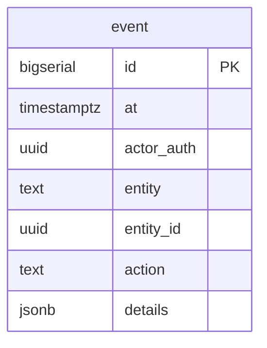

# Esquema `audit` - Auditoría

Este esquema registra eventos importantes del sistema para trazabilidad y auditoría.

---

## Diagrama ER



---

## Tablas

### `audit.event`

Registro de eventos de auditoría del sistema.

| Columna | Tipo | Nullable | Default | Descripción |
|---------|------|----------|---------|-------------|
| `id` | `bigserial` | NO | auto | Identificador único |
| `at` | `timestamptz` | NO | `now()` | Fecha/hora del evento |
| `actor_auth` | `uuid` | SÍ | - | Usuario que realizó la acción |
| `entity` | `text` | NO | - | Tipo de entidad afectada |
| `entity_id` | `uuid` | SÍ | - | ID de la entidad afectada |
| `action` | `text` | NO | - | Tipo de acción realizada |
| `details` | `jsonb` | SÍ | - | Detalles adicionales en JSON |

**Constraints:**
- `PRIMARY KEY (id)`

---

## Valores Comunes

### Tipos de entidad (`entity`)

| Valor | Descripción |
|-------|-------------|
| `order` | Pedido |
| `assignment` | Asignación de rider |
| `collection` | Cobro |
| `settlement` | Liquidación |
| `merchant` | Comercio |
| `courier` | Rider |
| `user_profile` | Perfil de usuario |

### Tipos de acción (`action`)

| Valor | Descripción |
|-------|-------------|
| `insert` | Creación de registro |
| `update` | Actualización de registro |
| `delete` | Eliminación de registro |
| `status_change` | Cambio de estado |
| `login` | Inicio de sesión |
| `logout` | Cierre de sesión |

---

## Ejemplos de Uso

### Registrar cambio de estado de pedido

```sql
INSERT INTO audit.event (actor_auth, entity, entity_id, action, details)
VALUES (
  auth.uid(),
  'order',
  'uuid-del-pedido',
  'status_change',
  '{"from": "recepcionado", "to": "en_transito", "courier_id": "uuid-del-rider"}'::jsonb
);
```

### Registrar asignación de rider

```sql
INSERT INTO audit.event (actor_auth, entity, entity_id, action, details)
VALUES (
  auth.uid(),
  'assignment',
  'uuid-de-la-asignacion',
  'insert',
  '{"order_id": "uuid-pedido", "courier_id": "uuid-rider"}'::jsonb
);
```

### Registrar pago de liquidación

```sql
INSERT INTO audit.event (actor_auth, entity, entity_id, action, details)
VALUES (
  auth.uid(),
  'settlement',
  'uuid-del-settlement',
  'status_change',
  '{"from": "open", "to": "paid", "total_gs": 1500000}'::jsonb
);
```

---

## Consultas Útiles

### Historial de acciones de un usuario

```sql
SELECT at, entity, action, details
FROM audit.event
WHERE actor_auth = 'uuid-del-usuario'
ORDER BY at DESC
LIMIT 50;
```

### Historial de un pedido específico

```sql
SELECT at, action, actor_auth, details
FROM audit.event
WHERE entity = 'order' AND entity_id = 'uuid-del-pedido'
ORDER BY at;
```

### Eventos de las últimas 24 horas

```sql
SELECT *
FROM audit.event
WHERE at >= now() - interval '24 hours'
ORDER BY at DESC;
```

### Conteo de acciones por tipo

```sql
SELECT action, count(*) as cantidad
FROM audit.event
WHERE at >= now() - interval '7 days'
GROUP BY action
ORDER BY cantidad DESC;
```

---

## Notas para Desarrolladores

### Cuándo registrar eventos

Se recomienda registrar eventos de auditoría en:

1. **Cambios de estado críticos**
   - Pedido cambia de estado
   - Liquidación se marca como pagada
   - Pago a rider confirmado

2. **Acciones administrativas**
   - Crear/editar comercio
   - Crear/editar rider
   - Modificar tarifas

3. **Operaciones financieras**
   - Cobros registrados
   - Liquidaciones creadas/modificadas

### Triggers automáticos (opcional)

Puedes crear triggers para registrar automáticamente ciertos eventos:

```sql
CREATE OR REPLACE FUNCTION audit.fn_log_order_status_change()
RETURNS TRIGGER
LANGUAGE plpgsql
AS $$
BEGIN
  IF OLD.delivery_status IS DISTINCT FROM NEW.delivery_status THEN
    INSERT INTO audit.event (actor_auth, entity, entity_id, action, details)
    VALUES (
      auth.uid(),
      'order',
      NEW.id,
      'status_change',
      jsonb_build_object(
        'from', OLD.delivery_status,
        'to', NEW.delivery_status
      )
    );
  END IF;
  RETURN NEW;
END;
$$;
```

### Retención de datos

Considera implementar una política de retención para evitar que la tabla crezca indefinidamente:

```sql
-- Eliminar eventos de más de 1 año
DELETE FROM audit.event WHERE at < now() - interval '1 year';
```

O usar particionamiento por fecha para mejor rendimiento.

### Integración con RLS

Cuando implementes Row Level Security, considera:
- Los admins pueden ver todos los eventos
- Los operadores pueden ver eventos de sus acciones
- Los comercios pueden ver eventos relacionados a sus pedidos

