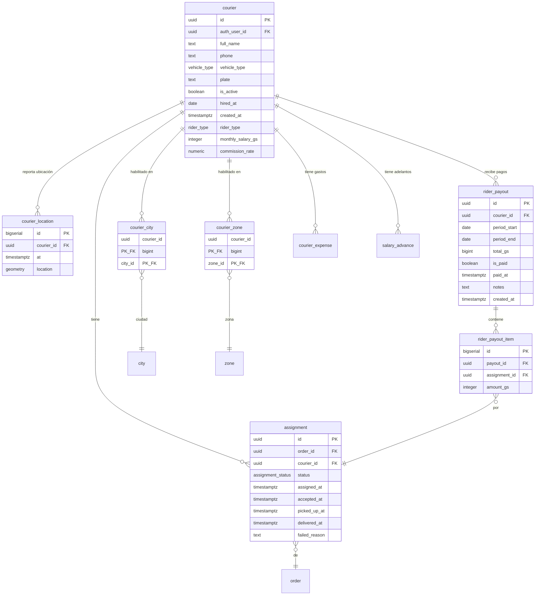

# Esquema `ops` - Operaciones

Este esquema gestiona las operaciones de entrega: riders (couriers), asignaciones de pedidos, tracking de ubicación y pagos a riders.

---

## Diagrama ER



---

## Tablas

### `ops.courier`

Riders/repartidores que realizan las entregas.

| Columna | Tipo | Nullable | Default | Descripción |
|---------|------|----------|---------|-------------|
| `id` | `uuid` | NO | `gen_random_uuid()` | Identificador único |
| `auth_user_id` | `uuid` | **NO** | - | FK a `core.user_profile` (obligatorio) |
| `full_name` | `text` | NO | - | Nombre completo del rider |
| `phone` | `text` | SÍ | - | Teléfono de contacto |
| `vehicle_type` | `vehicle_type` | NO | - | Tipo de vehículo |
| `plate` | `text` | SÍ | - | Placa del vehículo |
| `is_active` | `boolean` | NO | `true` | Si el rider está activo |
| `hired_at` | `date` | SÍ | - | Fecha de contratación |
| `created_at` | `timestamptz` | NO | `now()` | Fecha de registro |
| `rider_type` | `rider_type` | NO | `'fixed'` | Tipo de contratación (fijo/comisionista) |
| `monthly_salary_gs` | `integer` | NO | `0` | Salario mensual en Gs (solo para fijos) |
| `commission_rate` | `numeric(3,2)` | NO | `0.70` | Tasa de comisión (solo para comisionistas) |

**Constraints:**
- `PRIMARY KEY (id)`
- `FOREIGN KEY (auth_user_id) REFERENCES core.user_profile(auth_user_id) ON DELETE RESTRICT`

**Importante:** Todo courier debe tener un usuario en `core.user_profile` con `role = 'rider'`.

**Tipos de vehículo (`vehicle_type`):**

| Valor | Descripción |
|-------|-------------|
| `motorcycle` | Motocicleta |
| `car` | Automóvil |
| `bicycle` | Bicicleta |
| `on_foot` | A pie |

---

### `ops.assignment`

Asignaciones de pedidos a riders.

| Columna | Tipo | Nullable | Default | Descripción |
|---------|------|----------|---------|-------------|
| `id` | `uuid` | NO | `gen_random_uuid()` | Identificador único |
| `order_id` | `uuid` | NO | - | FK a `core.order` |
| `courier_id` | `uuid` | NO | - | FK a `ops.courier` |
| `status` | `assignment_status` | NO | `'pending'` | Estado de la asignación |
| `assigned_at` | `timestamptz` | NO | `now()` | Fecha de asignación |
| `accepted_at` | `timestamptz` | SÍ | - | Fecha de aceptación |
| `picked_up_at` | `timestamptz` | SÍ | - | Fecha de recogida |
| `delivered_at` | `timestamptz` | SÍ | - | Fecha de entrega (también para rechazado_puerta) |
| `failed_reason` | `text` | SÍ | - | Motivo si falló |
| `is_in_route` | `boolean` | NO | `false` | Si está en la ruta activa del rider |
| `route_position` | `smallint` | SÍ | - | Posición en la ruta (1, 2, 3...) |
| `customer_confirmed_at` | `timestamptz` | SÍ | - | Cuando el cliente confirmó disponibilidad |

**Constraints:**
- `PRIMARY KEY (id)`
- `FOREIGN KEY (order_id) REFERENCES core.order(id) ON DELETE CASCADE`
- `FOREIGN KEY (courier_id) REFERENCES ops.courier(id) ON DELETE RESTRICT`

**Índices:**
- `ix_assignment_order` en `(order_id)`
- `ix_assignment_courier_status` en `(courier_id, status)`

**Nota sobre `delivered_at`:**
Este campo se llena tanto para `entregado` como para `rechazado_puerta`, ya que en ambos casos el rider llegó físicamente al destino.

**Estados de asignación (`assignment_status`):**

| Valor | Descripción |
|-------|-------------|
| `pending` | Asignado, pendiente de aceptar |
| `accepted` | Rider aceptó la entrega |
| `picked_up` | Rider recogió el paquete |
| `en_route` | En ruta hacia el destino |
| `delivered` | Entrega completada |
| `failed` | Entrega fallida |
| `canceled` | Asignación cancelada |

**Trigger de validación:**
- `trg_assignment_check_area`: Valida que el rider esté habilitado para la zona/ciudad del pedido antes de asignar.

---

### `ops.courier_location`

Historial de ubicaciones GPS de los riders (tracking en tiempo real).

| Columna | Tipo | Nullable | Default | Descripción |
|---------|------|----------|---------|-------------|
| `id` | `bigserial` | NO | auto | Identificador único |
| `courier_id` | `uuid` | NO | - | FK a `ops.courier` |
| `at` | `timestamptz` | NO | `now()` | Timestamp de la ubicación |
| `location` | `geometry(Point,4326)` | NO | - | Coordenadas GPS |

**Constraints:**
- `PRIMARY KEY (id)`
- `FOREIGN KEY (courier_id) REFERENCES ops.courier(id) ON DELETE CASCADE`

**Índices:**
- `ix_courier_location` en `(courier_id, at DESC)` - Para obtener la última ubicación

**Uso:**
```sql
-- Última ubicación de un rider
SELECT location, at
FROM ops.courier_location
WHERE courier_id = '...'
ORDER BY at DESC
LIMIT 1;
```

---

### `ops.courier_city`

Ciudades en las que un rider está habilitado para entregar.

| Columna | Tipo | Nullable | Default | Descripción |
|---------|------|----------|---------|-------------|
| `courier_id` | `uuid` | NO | - | FK a `ops.courier` |
| `city_id` | `bigint` | NO | - | FK a `ref.city` |

**Constraints:**
- `PRIMARY KEY (courier_id, city_id)`
- `FOREIGN KEY (courier_id) REFERENCES ops.courier(id) ON DELETE CASCADE`
- `FOREIGN KEY (city_id) REFERENCES ref.city(id) ON DELETE CASCADE`

**Notas:**
- Un rider solo puede ser asignado a pedidos cuya ciudad de destino esté en esta tabla
- Si el rider tiene habilitación por zona, esa tiene prioridad

---

### `ops.courier_zone`

Zonas específicas en las que un rider está habilitado para entregar.

| Columna | Tipo | Nullable | Default | Descripción |
|---------|------|----------|---------|-------------|
| `courier_id` | `uuid` | NO | - | FK a `ops.courier` |
| `zone_id` | `bigint` | NO | - | FK a `ref.zone` |

**Constraints:**
- `PRIMARY KEY (courier_id, zone_id)`
- `FOREIGN KEY (courier_id) REFERENCES ops.courier(id) ON DELETE CASCADE`
- `FOREIGN KEY (zone_id) REFERENCES ref.zone(id) ON DELETE CASCADE`

**Notas:**
- Permite habilitación más granular que por ciudad
- Útil para zonas con tarifas especiales

---

### `ops.rider_payout`

Liquidaciones/pagos a riders por entregas realizadas.

| Columna | Tipo | Nullable | Default | Descripción |
|---------|------|----------|---------|-------------|
| `id` | `uuid` | NO | `gen_random_uuid()` | Identificador único |
| `courier_id` | `uuid` | NO | - | FK a `ops.courier` |
| `period_start` | `date` | NO | - | Inicio del período |
| `period_end` | `date` | NO | - | Fin del período |
| `total_gs` | `bigint` | NO | `0` | Total a pagar en guaraníes |
| `is_paid` | `boolean` | NO | `false` | Si ya se pagó |
| `paid_at` | `timestamptz` | SÍ | - | Fecha de pago |
| `notes` | `text` | SÍ | - | Notas adicionales |
| `created_at` | `timestamptz` | NO | `now()` | Fecha de creación |

**Constraints:**
- `PRIMARY KEY (id)`
- `FOREIGN KEY (courier_id) REFERENCES ops.courier(id) ON DELETE RESTRICT`

**Notas:**
- Solo el rol `admin` puede confirmar pagos a riders
- Al confirmar, se marca `settled_with_rider = true` en los pedidos incluidos

---

### `ops.rider_payout_item`

Detalle de cada entrega incluida en un pago a rider.

| Columna | Tipo | Nullable | Default | Descripción |
|---------|------|----------|---------|-------------|
| `id` | `bigserial` | NO | auto | Identificador único |
| `payout_id` | `uuid` | NO | - | FK a `ops.rider_payout` |
| `assignment_id` | `uuid` | NO | - | FK a `ops.assignment` |
| `amount_gs` | `integer` | NO | - | Monto por esta entrega |

**Constraints:**
- `PRIMARY KEY (id)`
- `FOREIGN KEY (payout_id) REFERENCES ops.rider_payout(id) ON DELETE CASCADE`
- `FOREIGN KEY (assignment_id) REFERENCES ops.assignment(id) ON DELETE RESTRICT`
- `UNIQUE (payout_id, assignment_id)` - No duplicar asignaciones en un pago

---

### `ops.courier_expense`

Gastos operativos de riders fijos (combustible, mantenimiento, etc.). Solo aplica a riders con `rider_type = 'fixed'`.

| Columna | Tipo | Nullable | Default | Descripción |
|---------|------|----------|---------|-------------|
| `id` | `uuid` | NO | `gen_random_uuid()` | Identificador único |
| `courier_id` | `uuid` | NO | - | FK a `ops.courier` |
| `expense_date` | `date` | NO | - | Fecha del gasto |
| `expense_type` | `text` | NO | - | Tipo: 'fuel', 'maintenance', 'other' |
| `amount_gs` | `integer` | NO | - | Monto en guaraníes (> 0) |
| `description` | `text` | SÍ | - | Descripción del gasto |
| `created_at` | `timestamptz` | SÍ | `now()` | Fecha de creación |
| `created_by` | `uuid` | SÍ | - | Usuario que registró |

**Constraints:**
- `PRIMARY KEY (id)`
- `FOREIGN KEY (courier_id) REFERENCES ops.courier(id)`
- `CHECK (expense_type IN ('fuel', 'maintenance', 'other'))`
- `CHECK (amount_gs > 0)`

**Trigger:**
- `trg_expense_only_fixed`: Valida que el courier sea de tipo `fixed` antes de insertar.

---

### `ops.salary_advance`

Adelantos de salario para riders fijos.

| Columna | Tipo | Nullable | Default | Descripción |
|---------|------|----------|---------|-------------|
| `id` | `uuid` | NO | `gen_random_uuid()` | Identificador único |
| `courier_id` | `uuid` | NO | - | FK a `ops.courier` |
| `advance_date` | `date` | NO | - | Fecha del adelanto |
| `amount_gs` | `integer` | NO | - | Monto en guaraníes (> 0) |
| `notes` | `text` | SÍ | - | Notas adicionales |
| `created_at` | `timestamptz` | SÍ | `now()` | Fecha de creación |
| `created_by` | `uuid` | SÍ | - | Usuario que registró |

**Constraints:**
- `PRIMARY KEY (id)`
- `FOREIGN KEY (courier_id) REFERENCES ops.courier(id)`
- `CHECK (amount_gs > 0)`

**Trigger:**
- `trg_advance_only_fixed`: Valida que el courier sea de tipo `fixed` antes de insertar.

---

## Funciones

### `ops.fn_get_my_courier()`

Retorna los datos del courier autenticado. **Usar desde la app del rider después del login.**

**Parámetros:** Ninguno (usa `auth.uid()` automáticamente)

**Retorna:**

| Columna | Tipo | Descripción |
|---------|------|-------------|
| `courier_id` | uuid | ID del courier |
| `full_name` | text | Nombre completo |
| `phone` | text | Teléfono |
| `vehicle_type` | vehicle_type | Tipo de vehículo |
| `plate` | text | Placa |
| `is_active` | boolean | Si está activo |
| `hired_at` | date | Fecha de contratación |

**Ejemplo de uso desde la app:**

```javascript
// Después del login, obtener datos del courier
const { data: courier, error } = await supabase
  .rpc('fn_get_my_courier');

if (courier && courier.length > 0) {
  const { courier_id, full_name, vehicle_type } = courier[0];
  // Guardar courier_id para usar en otras llamadas
}
```

---

### `ops.fn_courier_can_take(p_order_id, p_courier_id)`

Valida si un rider puede tomar un pedido según su habilitación de zonas/ciudades.

**Parámetros:**
- `p_order_id` (uuid): ID del pedido
- `p_courier_id` (uuid): ID del rider

**Retorna:** `boolean`

**Lógica:**
1. Obtiene la ciudad y zona del pedido desde `billing.order_pricing`
2. Verifica si el rider tiene la zona en `ops.courier_zone`
3. Si no, verifica si tiene la ciudad en `ops.courier_city`
4. Retorna `true` si alguna coincide

### `ops.fn_confirm_rider_payout(p_payout_id)`

Confirma el pago a un rider y marca los pedidos como rendidos.

**Parámetros:**
- `p_payout_id` (uuid): ID del pago

**Acciones:**
1. Marca `is_paid = true` y `paid_at = now()` en `ops.rider_payout`
2. Marca `settled_with_rider = true` en todos los pedidos relacionados

---

## Vistas

### `ops.v_order_tracking`

Vista consolidada para seguimiento de pedidos.

| Columna | Origen |
|---------|--------|
| `order_id` | `core.order.id` |
| `merchant_id` | `core.order.merchant_id` |
| `delivery_status` | `core.order.delivery_status` |
| `cash_status` | `core.order.cash_status` |
| `settled_with_merchant` | `core.order.settled_with_merchant` |
| `settled_with_rider` | `core.order.settled_with_rider` |
| `total_amount_gs` | `billing.order_pricing.total_amount_gs` |
| `courier_id` | `ops.assignment.courier_id` |
| `assignment_status` | `ops.assignment.status` |
| `delivery_window_start` | `core.order.delivery_window_start` |
| `delivery_window_end` | `core.order.delivery_window_end` |
| `requested_at` | `core.order.requested_at` |
| `due_by` | `core.order.due_by` |

**Ordenamiento:** `requested_at DESC`

---

## Notas para Desarrolladores

### Flujo de asignación

```
1. Operador selecciona pedido y rider
2. Trigger valida habilitación del rider (zona/ciudad)
3. Se crea assignment con status = 'pending'
4. Rider acepta → status = 'accepted'
5. Rider recoge → status = 'picked_up'
6. Rider en ruta → status = 'en_route'
7. Rider entrega → status = 'delivered'
```

### Tracking en tiempo real

La app móvil del rider debe enviar ubicaciones periódicamente a `ops.courier_location`. Ejemplo de inserción:

```sql
INSERT INTO ops.courier_location (courier_id, location)
VALUES (
  'uuid-del-rider',
  ST_SetSRID(ST_MakePoint(-57.6359, -25.2867), 4326)
);
```

### Pagos a riders

Solo administradores pueden ejecutar `ops.fn_confirm_rider_payout()`. Esto previene que operadores marquen pagos como completados sin autorización.

