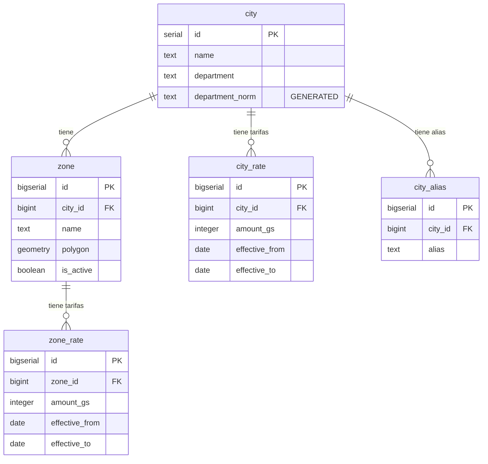

# Esquema `ref` - Datos de Referencia

Este esquema contiene los catálogos de referencia del sistema: ciudades, zonas geográficas y tarifas estándar de envío.

---

## Diagrama ER

---

## Tablas

### `ref.city`

Catálogo de ciudades donde se realizan entregas.

| Columna | Tipo | Nullable | Default | Descripción |
|---------|------|----------|---------|-------------|
| `id` | `serial` | NO | auto | Identificador único |
| `name` | `text` | NO | - | Nombre de la ciudad |
| `department` | `text` | SÍ | - | Departamento/provincia |
| `department_norm` | `text` | NO | GENERATED | Departamento normalizado (para índice único) |

**Constraints:**
- `PRIMARY KEY (id)`
- `UNIQUE (name, department_norm)` - No puede haber dos ciudades con el mismo nombre en el mismo departamento

**Ejemplo de ciudades:**
- San Lorenzo, Asunción, Capiatá, Ñemby, Fernando de la Mora, Luque, Villa Elisa, etc.

---

### `ref.zone`

Zonas dentro de una ciudad. Permite tarifas más granulares (ej: "San Lorenzo Centro" vs "San Lorenzo Alrededores").

| Columna | Tipo | Nullable | Default | Descripción |
|---------|------|----------|---------|-------------|
| `id` | `bigserial` | NO | auto | Identificador único |
| `city_id` | `bigint` | NO | - | FK a `ref.city` |
| `name` | `text` | NO | - | Nombre de la zona |
| `polygon` | `geometry` | SÍ | - | Polígono geográfico (PostGIS) |
| `is_active` | `boolean` | NO | `true` | Si la zona está activa |

**Constraints:**
- `PRIMARY KEY (id)`
- `FOREIGN KEY (city_id) REFERENCES ref.city(id) ON DELETE CASCADE`
- `UNIQUE (city_id, name)` - No puede haber dos zonas con el mismo nombre en la misma ciudad

**Ejemplo de zonas:**
- San Lorenzo Centro
- San Lorenzo Alrededores

---

### `ref.city_rate`

Tarifas estándar de envío por ciudad. Soporta historial con fechas de vigencia.

| Columna | Tipo | Nullable | Default | Descripción |
|---------|------|----------|---------|-------------|
| `id` | `bigserial` | NO | auto | Identificador único |
| `city_id` | `bigint` | NO | - | FK a `ref.city` |
| `amount_gs` | `integer` | NO | - | Monto en guaraníes (debe ser > 0) |
| `effective_from` | `date` | NO | `current_date` | Fecha desde la cual aplica |
| `effective_to` | `date` | SÍ | - | Fecha hasta la cual aplica (null = vigente) |

**Constraints:**
- `PRIMARY KEY (id)`
- `FOREIGN KEY (city_id) REFERENCES ref.city(id) ON DELETE CASCADE`
- `UNIQUE (city_id, effective_from)` - Una sola tarifa por ciudad por fecha inicio
- `CHECK (amount_gs > 0)`

**Ejemplo de tarifas estándar:**

| Ciudad | Tarifa |
|--------|--------|
| San Lorenzo Centro | 15.000 Gs |
| San Lorenzo Alrededores | 20.000 Gs |
| Capiatá | 25.000 Gs |
| Asunción | 30.000 Gs |

---

### `ref.zone_rate`

Tarifas estándar de envío por zona (más específico que ciudad).

| Columna | Tipo | Nullable | Default | Descripción |
|---------|------|----------|---------|-------------|
| `id` | `bigserial` | NO | auto | Identificador único |
| `zone_id` | `bigint` | NO | - | FK a `ref.zone` |
| `amount_gs` | `integer` | NO | - | Monto en guaraníes (debe ser > 0) |
| `effective_from` | `date` | NO | `current_date` | Fecha desde la cual aplica |
| `effective_to` | `date` | SÍ | - | Fecha hasta la cual aplica (null = vigente) |

**Constraints:**
- `PRIMARY KEY (id)`
- `FOREIGN KEY (zone_id) REFERENCES ref.zone(id) ON DELETE CASCADE`
- `UNIQUE (zone_id, effective_from)` - Una sola tarifa por zona por fecha inicio
- `CHECK (amount_gs > 0)`

---

### `ref.city_alias`

Alias o nombres alternativos para ciudades. Útil para el parsing de mensajes WhatsApp.

| Columna | Tipo | Nullable | Default | Descripción |
|---------|------|----------|---------|-------------|
| `id` | `bigserial` | NO | auto | Identificador único |
| `city_id` | `bigint` | NO | - | FK a `ref.city` |
| `alias` | `text` | NO | - | Nombre alternativo |

**Constraints:**
- `PRIMARY KEY (id)`
- `FOREIGN KEY (city_id) REFERENCES ref.city(id) ON DELETE CASCADE`
- `UNIQUE (city_id, lower(alias))` - Un alias único por ciudad (case-insensitive)

**Índices:**
- `ix_city_alias_alias` en `lower(alias)` - Búsqueda rápida de alias

**Ejemplo:**
- "Fdo de la Mora" → Fernando de la Mora
- "MRA" → Mariano Roque Alonso
- "SLO" → San Lorenzo

---

## Resolución de Tarifas

El sistema busca tarifas en este orden de prioridad:

1. **Tarifa por zona** (`zone_rate`) - si el pedido tiene zona definida
2. **Tarifa por ciudad** (`city_rate`) - fallback si no hay zona

La función `billing.fn_resolve_rate_v2()` implementa esta lógica considerando también tarifas custom por comercio.

---

## Notas para Desarrolladores

- Las coordenadas de ubicación (del mensaje WhatsApp) se usan para determinar la ciudad/zona mediante PostGIS
- Los alias de ciudad son críticos para el parsing automático de mensajes
- Las tarifas tienen vigencia temporal para permitir cambios de precios sin perder historial

