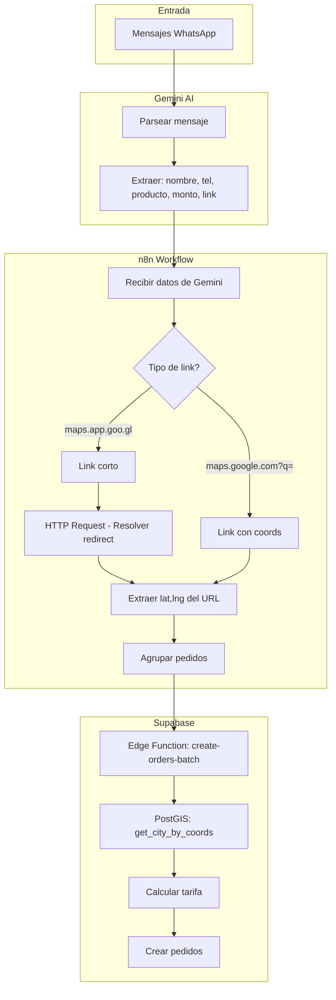

# Geocoding Automático de Pedidos

## Problema

Los usuarios envían ubicaciones de entrega en diferentes formatos:
- Links cortos: `https://maps.app.goo.gl/xxxxx`
- Links con coordenadas: `https://maps.google.com/?q=-25.297852,-57.579697`
- Ubicaciones de WhatsApp con nombre + link

Actualmente, el operador debe identificar manualmente la ciudad para asignar la tarifa correcta.

## Solución Propuesta

### Arquitectura

```
WhatsApp → Gemini → n8n → Supabase (PostGIS) → Pedido creado
```

| Componente | Responsabilidad |
|------------|-----------------|
| Gemini | Extraer datos básicos: nombre, teléfono, producto, monto, link de maps |
| n8n | Resolver links cortos, extraer coordenadas (en paralelo) |
| Supabase/PostGIS | Determinar ciudad por coordenadas, calcular tarifa, crear pedido |

### Flujo Detallado



---

## Implementación en Supabase

### 1. Habilitar PostGIS

```sql
-- Habilitar extensión PostGIS
CREATE EXTENSION IF NOT EXISTS postgis;
```

### 2. Agregar columna de geometría a ciudades

```sql
-- Agregar columna para almacenar el polígono de cada ciudad
ALTER TABLE ref.city ADD COLUMN IF NOT EXISTS boundary geometry(Polygon, 4326);

-- Índice espacial para búsquedas rápidas
CREATE INDEX IF NOT EXISTS idx_city_boundary ON ref.city USING GIST (boundary);
```

### 3. Cargar polígonos de ciudades

Los polígonos se pueden obtener de OpenStreetMap (Overpass API) o de datos oficiales de Paraguay.

```sql
-- Ejemplo: Cargar polígono de San Lorenzo
UPDATE ref.city 
SET boundary = ST_GeomFromGeoJSON('{
  "type": "Polygon",
  "coordinates": [[[lng1,lat1], [lng2,lat2], ...]]
}')
WHERE id = 1;
```

**Fuentes de datos geográficos:**
- [OpenStreetMap](https://www.openstreetmap.org/)
- [Overpass Turbo](https://overpass-turbo.eu/) - Query para obtener límites administrativos
- [GADM](https://gadm.org/download_country.html) - Límites administrativos de Paraguay

### 4. Función para obtener ciudad por coordenadas

```sql
CREATE OR REPLACE FUNCTION get_city_by_coords(
  lat double precision, 
  lng double precision
)
RETURNS TABLE(city_id bigint, city_name text) AS $$
BEGIN
  RETURN QUERY
  SELECT c.id, c.name
  FROM ref.city c
  WHERE ST_Contains(c.boundary, ST_SetSRID(ST_MakePoint(lng, lat), 4326))
  LIMIT 1;
END;
$$ LANGUAGE plpgsql;
```

### 5. Edge Function para crear pedidos con coordenadas

```typescript
// supabase/functions/create-order-with-coords/index.ts
import "jsr:@supabase/functions-js/edge-runtime.d.ts";
import { createClient } from "jsr:@supabase/supabase-js@2";

interface OrderRequest {
  merchantId: string;
  recipientName: string;
  recipientPhone?: string;
  lat: number;
  lng: number;
  description: string;
  cashToCollect: number;
}

Deno.serve(async (req: Request) => {
  const supabase = createClient(
    Deno.env.get("SUPABASE_URL")!,
    Deno.env.get("SUPABASE_SERVICE_ROLE_KEY")!
  );

  const order: OrderRequest = await req.json();

  // 1. Obtener ciudad por coordenadas
  const { data: cityData, error: cityError } = await supabase
    .rpc('get_city_by_coords', { lat: order.lat, lng: order.lng });

  if (cityError || !cityData || cityData.length === 0) {
    return new Response(JSON.stringify({ 
      error: 'Ciudad no encontrada para las coordenadas' 
    }), { status: 400 });
  }

  const cityId = cityData[0].city_id;

  // 2. Crear el pedido con la ciudad detectada
  // ... (usar lógica existente de createOrder)

  return new Response(JSON.stringify({ 
    success: true, 
    cityId,
    cityName: cityData[0].city_name 
  }));
});
```

---

## Implementación en n8n

### Workflow: Resolver Links de Google Maps

```json
{
  "nodes": [
    {
      "name": "Webhook - Recibir de Gemini",
      "type": "n8n-nodes-base.webhook",
      "parameters": {
        "path": "orders-from-gemini",
        "httpMethod": "POST"
      }
    },
    {
      "name": "Split Items",
      "type": "n8n-nodes-base.splitInBatches",
      "parameters": {
        "batchSize": 10
      }
    },
    {
      "name": "Resolver Link Corto",
      "type": "n8n-nodes-base.httpRequest",
      "parameters": {
        "url": "={{ $json.mapsLink }}",
        "method": "GET",
        "options": {
          "redirect": {
            "redirect": {
              "followRedirects": true,
              "maxRedirects": 5
            }
          }
        }
      }
    },
    {
      "name": "Extraer Coordenadas",
      "type": "n8n-nodes-base.code",
      "parameters": {
        "jsCode": "// Extraer coordenadas del URL final\nconst url = $input.item.json.headers?.location || $input.item.json.url;\nconst match = url.match(/[?&]q=(-?\\d+\\.\\d+),(-?\\d+\\.\\d+)/);\n\nif (match) {\n  return {\n    lat: parseFloat(match[1]),\n    lng: parseFloat(match[2])\n  };\n}\n\n// Intentar otro formato\nconst match2 = url.match(/@(-?\\d+\\.\\d+),(-?\\d+\\.\\d+)/);\nif (match2) {\n  return {\n    lat: parseFloat(match2[1]),\n    lng: parseFloat(match2[2])\n  };\n}\n\nreturn { error: 'No se pudieron extraer coordenadas' };"
      }
    },
    {
      "name": "Enviar a Supabase",
      "type": "n8n-nodes-base.httpRequest",
      "parameters": {
        "url": "https://crvqpztzddxktyjukeph.supabase.co/functions/v1/create-order-with-coords",
        "method": "POST",
        "headers": {
          "Authorization": "Bearer {{ $credentials.supabaseApiKey }}"
        },
        "body": {
          "merchantId": "={{ $json.merchantId }}",
          "recipientName": "={{ $json.name }}",
          "recipientPhone": "={{ $json.phone }}",
          "lat": "={{ $json.lat }}",
          "lng": "={{ $json.lng }}",
          "description": "={{ $json.products }}",
          "cashToCollect": "={{ $json.total }}"
        }
      }
    }
  ]
}
```

---

## Lista de ciudades con coordenadas de referencia

Para obtener los polígonos, usar esta query en Overpass Turbo:

```
[out:json];
area["name"="Paraguay"]->.country;
(
  relation["admin_level"="8"]["name"~"San Lorenzo|Capiatá|Ñemby|..."](area.country);
);
out geom;
```

| city_id | Nombre | Coordenadas Centro (aprox) |
|---------|--------|---------------------------|
| 1 | San Lorenzo | -25.3394, -57.5089 |
| 2 | Capiatá | -25.3550, -57.4450 |
| 3 | Ñemby | -25.3950, -57.5350 |
| 4 | Ypané | -25.4650, -57.5350 |
| 5 | Fernando de la Mora | -25.3200, -57.5550 |
| 6 | Luque | -25.2700, -57.4850 |
| 7 | Asunción | -25.2867, -57.6470 |
| 8 | Villa Elisa | -25.3750, -57.5950 |
| 9 | Mariano Roque Alonso | -25.2050, -57.5350 |
| 10 | Julián Augusto Saldívar | -25.4150, -57.4450 |
| 11 | San Antonio | -25.4250, -57.5850 |
| 12 | Itá | -25.5050, -57.3650 |
| 13 | Limpio | -25.1650, -57.4850 |
| 14 | Itauguá | -25.3850, -57.3550 |
| 15 | Areguá | -25.2950, -57.3850 |
| 16 | Lambaré | -25.3450, -57.6150 |
| 17 | Guarambaré | -25.4850, -57.4550 |

---

## Pasos para implementar

### Fase 1: Supabase (PostGIS)
1. [ ] Habilitar extensión PostGIS
2. [ ] Agregar columna `boundary` a `ref.city`
3. [ ] Obtener polígonos de las 17 ciudades (OpenStreetMap)
4. [ ] Cargar polígonos en la BD
5. [ ] Crear función `get_city_by_coords`
6. [ ] Crear Edge Function `create-order-with-coords`

### Fase 2: n8n
1. [ ] Instalar/configurar n8n
2. [ ] Crear workflow para resolver links
3. [ ] Configurar webhook para recibir de Gemini
4. [ ] Configurar conexión con Supabase

### Fase 3: Gemini
1. [ ] Actualizar prompt para extraer links de maps
2. [ ] Configurar envío a webhook de n8n

### Fase 4: Testing
1. [ ] Probar con diferentes formatos de links
2. [ ] Verificar precisión del geocoding
3. [ ] Test de carga con múltiples pedidos

---

## Estimación de tiempo

| Fase | Tiempo estimado |
|------|-----------------|
| Fase 1: Supabase | 4-6 horas |
| Fase 2: n8n | 2-3 horas |
| Fase 3: Gemini | 1 hora |
| Fase 4: Testing | 2-3 horas |
| **Total** | **9-13 horas** |

---

## Notas adicionales

- Los polígonos de OpenStreetMap pueden no ser 100% precisos en los límites
- Considerar un "fallback" para coordenadas que caigan fuera de todas las ciudades
- Para links cortos, la resolución puede fallar si Google cambia el formato
- Guardar las coordenadas originales en `core.address` para referencia futura
